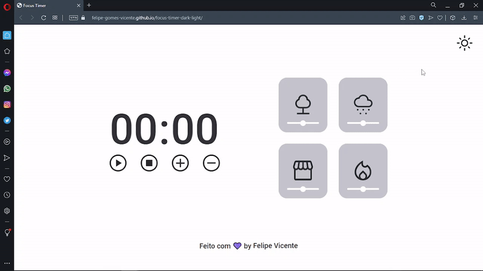
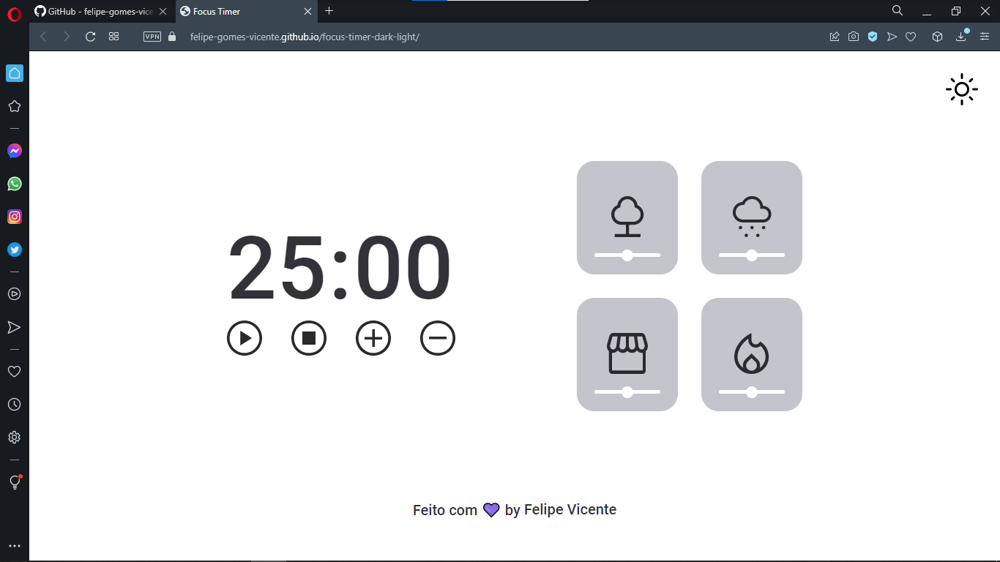
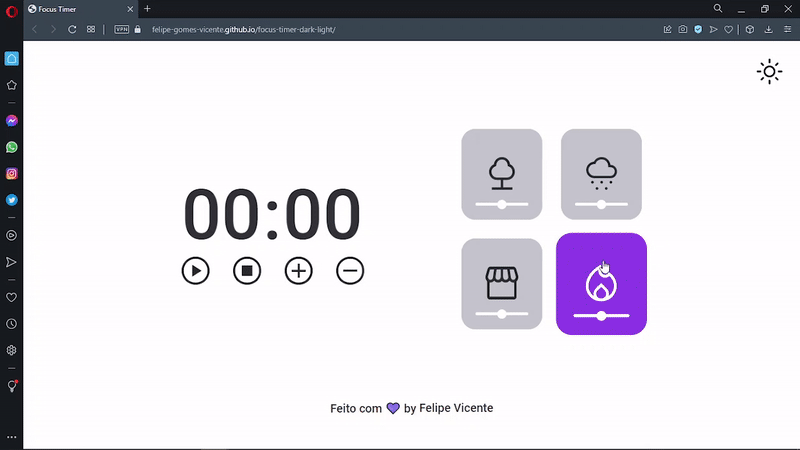

# Focus Timer Dark

<h1 align="center">
    
</h1>

<br>

### 💻 Focus Timer Dark

O desafio é construír uma página completa com contagem regressiva no estilo Pomodoro  
com HTML, Javascript e CSS, foi aplicado responsvidade e linguagem de programação 
javascript com em destaque tema escuro para acessibilidade, cards de audio, funções 
callbacks, Clean Code, injeção de dependências e padrão factory.
Desafeei-me e apliquei imagens diferentes para cada cards de audio, refatoração 
e melhoria do algoritmo e adição de footer.

Acesse a página do projeto: [Clique Aqui](https://felipe-gomes-vicente.github.io/focus-timer-dark-light/)

O que foi feito:

- Lógica e Algoritmos com Javascript;
- Desafeei-me e apliquei imagens diferentes para cada cards de audio quando acionado;
- Refatoração e melhoria do algoritmo e adição de footer;
- Criação da versão de tema escuro;
- Funcionalidade de botões de controle do play acionar timer, pausar e parar;
- Funcionalidade de botões de controle do play aumenta em mais 5 minutos o tempo do timer;
- Funcionalidade de botões de controle do play dimuinuir em mais 5 minutos o tempo do timer;
- Cards de audio que acionar som e pausa;
- Variáveis, operadores matemáticos e operadores comparativos;
- Tipos de dados no javascipt;
- Manipular a DOM;
- Funções callbacks;
- Recursividade;
- Clean Code;
- ES6 Modules;
- Padrão Factory;
- Injeção de dependências;
- Refatoração de código;
- Estruturando HTML com tags semânticas;
- Responsividade com CSS Flex Box e CSS GRID;
- Unidade de medida flexível;
- Breakpoints com media query;
- Posição dos elementos na tela;
- Importar arquivo de CSS externo no projeto;
- Aplicando fontes(tipografia) customizadas no arquivo do CSS e iniciar o CSS externo;
- Trabalhando com cores e fontes;
- Alinhando e posicionando textos e elementos;
- Aplicando os espaçamentos;
- Bordas e classificações de elementos;
- O conceito Box Model do CSS flexbox e aplicar CSS GRID;
- Animações CSS e transições;
- Utilizar variaveis CSS para manipular a paleta de cores do projeto e fontes;
- Reset CSS removendo possíveis inconsistências entre navegadores diferentes;
- Estrutura de sistema de arquivos do projeto separado por pasta;


Aplicado meu conhecimento do Explorer da Rocketseat conceitos de forma prática 
nesse projeto, com as aulas:

- Conhecendo novos conceitos de HTML e CSS;
- Avançando no HTML e CSS;
- Responsividade;
- Introdução á Programação, Lógica e Algoritmos com Javascript;
- Avançando na Programação WEB com Javacript;
  
<br />

- [EXPLORER - Rocketseat](https://www.rocketseat.com.br/explorer)
- [Figma do Projeto - Focus Timer Dark](https://www.figma.com/file/fWDqeHD7LozcLUQFGU7ItC/Stage-05---Dark-Mode-FocusTimer-(Copy))

## Imagem do Projeto concluído:
 

 <br />

 <p>Gif do Projeto Mobile</p>


## 🧪 Tecnologias

Aplicação desenvolvida usando as seguintes tecnologias:

- [HTML5](https://www.w3schools.com/html/default.asp)
- [CSS3](https://www.w3schools.com/css/default.asp)
- [Javascript](https://developer.mozilla.org/pt-BR/docs/Web/JavaScript)

## 🚀 Iniciar Projeto

Clonar Projeto e acesar pasta e iniciar Live server no Visual Studio Code.

### Programas necessários para iniciar projeto

- [Live Server (Opcional)](https://marketplace.visualstudio.com/items?itemName=ritwickdey.LiveServer)
- [Visual Studio Code - Vscode](https://code.visualstudio.com/)

Clone o projeto e acesso a pasta.

```bash
$ git clone https://github.com/felipe-gomes-vicente/focus-timer-dark-light.git
$ cd focus-timer-dark-light
```

## 📝 Licença

Esse projeto está sob a licença MIT. Veja o arquivo [LICENSE](LICENSE.md) para mais detalhes.

---

&nbsp;

<p align="center">Feito com 💜 by Felipe Vicente👋</p>

- ## Meu LinkedIn - [](https://www.linkedin.com/in/felipe-gomes-vicente/)
